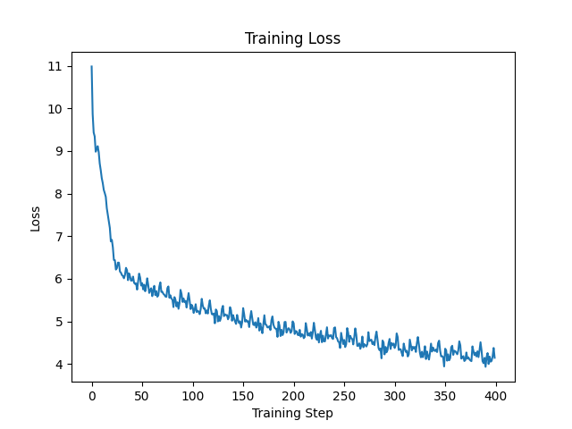

# GPT-2 From Scratch

A from-scratch reimplementation of GPT-2 (124M) in PyTorch, following Andrej Karpathy's [*Let's reproduce GPT-2*](https://www.youtube.com/watch?v=l8pRSuU81PU) tutorial series. The model is trained on the Tiny Shakespeare dataset and produces stylistically coherent Shakespeare-style continuations.

This project was an exercise in deeply understanding the Transformer architecture, modern training infrastructure (mixed precision, gradient accumulation, learning rate schedules), and the practical engineering of LLM systems — implemented end-to-end without copying reference code.

## Highlights

- **Full architecture**: token/position embeddings, multi-head causal self-attention, MLP blocks with GELU, pre-LayerNorm, residual connections, weight tying between embedding and output projection
- **Pretrained weight loading** from HuggingFace's official `gpt2` checkpoint, with handling of the Conv1D weight transposition
- **Training pipeline** with AdamW (decoupled weight decay), cosine learning rate schedule with linear warmup, gradient accumulation, BF16 mixed precision, gradient clipping, and TF32 matmul
- **Generation script** with categorical sampling
- Trained on **RTX 4090** to ~70K tokens/sec throughput

## Results

### Training Loss

Trained for 400 steps on Tiny Shakespeare with `total_batch_size=16384`, `seq_len=256`. Loss converges from ~11.0 (random init) → ~4.0.



### Generation Samples

**In-distribution prompt** (`"First Citizen:\nWe are accounted poor citizens..."`):

```
First Citizen:
We are accounted poor citizens, the patricians good.

ENSIO:
For you in from his grave
theon in the law broke the Tower, O that CA:
No than you
```

The model captures Shakespeare's structural conventions — character names, dialogue formatting, vocabulary (`grave`, `Tower`, `wretched`), and themes (death, law, violence).

**Out-of-distribution prompt** (`"Hello, I'm a language model..."`):

```
Hello, I'm a language model, and I can generate text based on the input prompt. I can
subject he news
Therefore walk: icyenacking lying
There is few. We shall entbuckant: harhatow, know again,
```

The model has never seen modern English in training and defaults to Shakespeare-style continuations regardless of prompt. This illustrates a clear case of **distribution mismatch** — the model can only model what it has seen.

Full generation samples: [`samples/`](./samples/)

## Architecture Notes

This implementation follows the GPT-2 paper and Karpathy's tutorial, with a few details worth highlighting:

- **Weight tying** between the token embedding `wte` and the LM head reduces parameters by ~38M (out of 124M) and serves as a form of regularization. The justification is empirical rather than theoretical (Press & Wolf, 2017).
- **Scaled init for residual projections**: layers preceding residual connections (`attn.c_proj`, `mlp.c_proj`) are initialized with `std = 0.02 / sqrt(2 * n_layer)` to keep activation variance stable through depth.
- **HuggingFace weight transposition**: HF's GPT-2 stores `attn.c_attn`, `attn.c_proj`, `mlp.c_fc`, `mlp.c_proj` as Conv1D (transposed of `nn.Linear`). The loader applies `.t()` on these specific keys.
- **Pre-LayerNorm**: LayerNorm is applied *before* attention/MLP within each block, with residual connections around the sub-blocks. This is the modern convention (GPT-2/3) and trains more stably than Post-LayerNorm.

## Training Details

| Config | Value |
|---|---|
| Model | GPT-2 small (12 layers, 12 heads, 768 dim) |
| Parameters | 124M (with weight tying) |
| Dataset | Tiny Shakespeare (~338K tokens) |
| Tokenizer | tiktoken `gpt2` BPE |
| Total batch size | 16,384 tokens |
| Sequence length | 256 |
| Gradient accumulation steps | 8 |
| Optimizer | AdamW (β1=0.9, β2=0.95, wd=0.1) |
| Learning rate | 6e-4 → 6e-5 (cosine) |
| Warmup | 5 steps |
| Precision | BF16 mixed precision + TF32 matmul |
| Hardware | 1× RTX 4090 (24GB) |
| Throughput | ~70K tokens/sec |

## Debug Journey

A few non-trivial bugs encountered during implementation — leaving them here as they're representative of the kind of pitfalls that don't appear in tutorials:

**1. Logit explosion at initialization (loss ≈ 425)**

PyTorch's default initializations (Kaiming uniform for `nn.Linear`, `std=1.0` for `nn.Embedding`) produced logits with extreme variance, giving a starting loss of ~425 instead of the expected ~`-ln(1/50257) ≈ 10.83`. Fixed by implementing `_init_weights` with `std=0.02` for Linear/Embedding (applied via `self.apply()`), plus scaled init on residual projections.

**2. `torch.compile` checkpoint prefix issue**

When training with `torch.compile`, the model is wrapped and saved state dicts get `_orig_mod.` prefixed to every key. Loading on a non-compiled model fails with hundreds of missing/unexpected keys. Fixed in `from_pretrained` by stripping the prefix on load:

```python
cleaned = {k.replace("_orig_mod.", ""): v for k, v in state_dict.items()}
```

**3. Generation order: softmax then index, not the reverse**

A subtle but wasteful bug — applying softmax over the full `(B, T, vocab_size)` tensor and *then* indexing the last position computes softmax for every position unnecessarily. The correct order is index `[:, -1, :]` first, then softmax.

## Project Structure

```
├── model.py          # GPT, Block, CausalSelfAttention, MLP, weight loading
├── train_gpt2.py     # Training loop with mixed precision, grad accum, LR schedule
├── generate.py       # Sampling from a trained checkpoint
├── input.txt         # Tiny Shakespeare dataset
├── log.txt           # Training log (per-step loss, throughput, gradient norm)
├── training_loss.png # Loss curve
└── samples/          # Generation outputs
```

## How to Run

```bash
pip install torch tiktoken transformers matplotlib

# Train
python train_gpt2.py

# Generate
python generate.py
```

Trained checkpoint not included due to GitHub file size limits.

## References

- Radford et al., *Language Models are Unsupervised Multitask Learners* (GPT-2, 2019)
- Karpathy, *Let's reproduce GPT-2 (124M)*, YouTube tutorial
- Press & Wolf, *Using the Output Embedding to Improve Language Models*, EACL 2017 (weight tying)